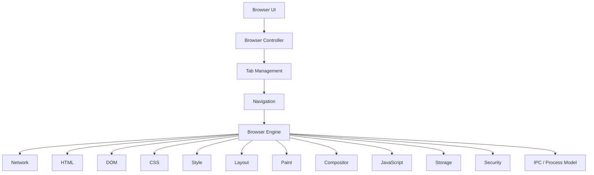
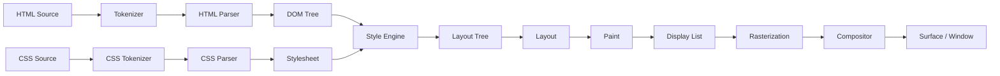

# 总体架构

> 版本：Phase 0 快照 · 2026-08
> 本文档描述 neko-browser 的长期架构目标与当前已落地的部分。

## 1. 项目目标

构建一个**从零实现、真实可运行、跨平台**的浏览器引擎与浏览器应用，主要使用
C++20。核心引擎（网络、HTML、DOM、CSS、样式、布局、绘制、合成、JavaScript 绑定、
存储、安全）由本项目自己实现；第三方库只用于基础设施（测试、TLS、字体、图形等），
且必须封装在项目自己的接口之后。

## 2. 顶层架构



依赖方向遵循 **UI → Browser → Engine → Core/Platform** 的单一方向，禁止反向依赖
（如 `DOM → UI`、`layout → settings`）。若出现循环依赖，必须先停下重构架构，再继续。

## 3. 数据流（渲染管线）



关键约束：

- HTML 必须走 tokenizer → parser → DOM，**禁止用正则实现 HTML 解析**。
- CSS 必须分阶段：tokenizer → parser → stylesheet → selector matching →
  cascade → computed style，**禁止把 CSS 塞进一个巨型函数**。
- DOM 与 Layout Tree **概念上必须分离**。
- 布局 → 绘制 → 光栅化 → 合成各阶段通过明确的 API 边界通信。

## 4. 模块职责与边界

### core / base（Phase 0 已落地）

- 职责：日志、Error/Result 模型、字符串工具、版本、断言、后续的 Task/Event/Time/URI。
- 不负责：任何与浏览器语义相关的逻辑。
- 现状：**Implemented + Tested**（Phase 0）。

### url（Phase 1）

- 职责：URL 解析、scheme/host/port/path/query/fragment、百分号编码、
  相对 URL 解析、Origin。
- 不负责：网络传输。

### network（Phase 2）

- 分层：`URL → HTTP → TLS → TCP → Socket`。
- 职责：Socket、DNS、HTTP/1.1（请求/响应/头/分块传输/keep-alive/重定向/压缩）、
  HTTPS（TLS 抽象层，可封装 OpenSSL/mbedTLS/BoringSSL）。

### html / dom（Phase 3）

- `HTML Source → Tokenizer → Token Stream → Parser → DOM`。
- DOM：Node/Document/Element/Text/Comment/DocumentFragment，父子关系、
  appendChild/removeChild/insertBefore、属性、querySelector 等。
- 畸形 HTML 是正常输入，不是异常。

### css / style（Phase 4）

- `CSS Source → Tokenizer → Parser → Stylesheet → Selector Matching → Cascade →
  Computed Style`。
- 考虑：继承、特异性、级联、内联样式、UA 样式表。

### layout（Phase 5）

- 独立 Layout Tree：`DOM → Style → Layout Tree → Layout → Paint Tree`。
- 先实现 block / inline / text layout 与盒模型（content/padding/border/margin）。
- Flexbox/Grid 单独里程碑实现，禁止伪装成 block layout。

### rendering / paint / graphics（Phase 6）

- `Layout Tree → Paint → Display List → Rasterization → Compositor → Window`。
- 图形抽象层：`Graphics Abstraction → {Software, OpenGL, Vulkan, Metal, Direct3D}`。
- 核心渲染器不得直接绑定平台 API。

### javascript / webapi（Phase 8–9）

- 架构预留：`JS Engine → {Parser, AST, Bytecode, VM, GC}` + Web IDL 绑定层。
- 若早期接入第三方 JS 引擎（QuickJS/V8/JavaScriptCore），它只能充当 JS runtime，
  **不得替代** DOM/CSS/布局/渲染/导航/安全/存储。

### storage / security / ipc（Phase 10–12）

- 存储：Cookie、HTTP Cache、LocalStorage、SessionStorage、IndexedDB、History、
  Bookmarks、Downloads；Profile 结构。
- 安全：Origin、SOP、CORS、CSP、Cookie 安全、TLS 校验、沙箱、权限、进程隔离。
- 多进程：Browser / Renderer / Network / GPU / Utility 进程 + IPC。
  Phase 0–11 单进程，但代码架构必须允许平滑迁移到多进程。

## 5. 目录结构约定

每个模块采用统一的布局（自 Phase 0 起）：

```text
src/<module>/
  include/neko/<module>/   公共头文件（对外 API）
  src/                     实现
  CMakeLists.txt
```

测试：

```text
tests/unit/<module>/      单元测试
```

模块以库目标 `neko::<module>` 暴露，命名空间 `neko::<module>`。

## 6. 关键设计原则

1. **Ownership 显式化**：优先 `std::unique_ptr`，其次裸引用/指针（非拥有），
   `std::shared_ptr` 仅在所有权确实共享时使用。避免引用环。
2. **线程模型显式化**：每个并发子系统必须文档化所属线程、同步机制、线程安全
   API、生命周期保证。不随意引入后台线程。
3. **平台无关**：核心引擎不得直接依赖 Win32/X11/Wayland/Cocoa/AppKit；平台代码
   集中在 `src/platform/{linux,windows,macos}/`。
4. **无伪实现**：`return true;` 充当实现、硬编码输出、空函数都是禁止的。
   未完成的功能必须明确标注 `NOT IMPLEMENTED` / `PARTIALLY IMPLEMENTED`。
5. **依赖方向**：`UI → Browser → Engine → Rendering/Layout/DOM/Network → Core/Platform`。

## 7. 当前已落地（Phases 0–6）

```text
src/base/       日志、Error/Result、字符串、UTF-8、版本、断言 —— Tested
src/url/        URL 解析、相对解析、百分号编码、Origin —— Tested
src/network/    TCP Socket（POSIX）、HTTP/1.1 GET、重定向、chunked —— Tested
src/dom/        Node 树、Element/Text/Comment/Document、querySelector —— Tested
src/html/       tokenizer + 树构建（插入模式子集）、字符引用 —— Tested
src/css/        tokenizer/parser、选择器、级联输入、颜色/值 —— Tested
src/style/      UA 表 + 级联 + 继承 + 计算样式 —— Tested
src/layout/     盒模型、block/inline 布局、换行 —— Tested
src/paint/      显示列表、软件光栅化、位图字体、PPM —— Tested
src/renderer/   页面管线编排（headless）—— Tested
src/browser/    CLI（--url/--dump-dom/--screenshot）—— Tested
```

端到端验证：`neko_browser --url http://example.com/ --screenshot out.ppm`
可抓取并渲染真实网页。

未开始：JavaScript、Web APIs、Storage、Security 子系统、IPC/多进程、GUI、
DevTools、Accessibility。见[开发路线图](development/roadmap.md)。
