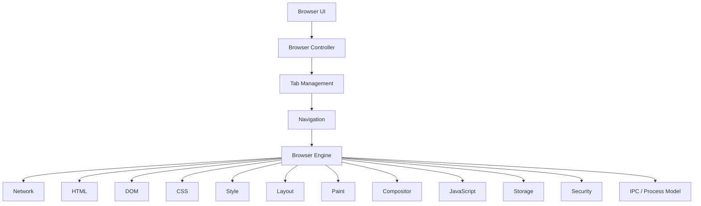
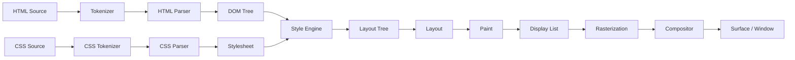

# 总体架构

> 版本：Phases 0–7 快照 · 2026-08
> 本文档描述 neko-browser 的长期架构目标与当前已落地的部分。

## 1. 项目目标

构建一个**从零实现、真实可运行、跨平台**的浏览器引擎与浏览器应用，主要使用
C++20。核心引擎（网络、HTML、DOM、CSS、样式、布局、绘制、合成、JavaScript 绑定、
存储、安全）由本项目自己实现；第三方库只用于基础设施（测试、TLS、字体、图形等），
且必须封装在项目自己的接口之后。

## 2. 顶层架构



依赖方向遵循 **UI → Browser → Engine → Core/Platform** 的单一方向，禁止反向依赖
（如 `DOM → UI`、`layout → settings`）。若出现循环依赖，必须先停下重构架构，再继续。

## 3. 数据流（渲染管线）



关键约束：

- HTML 必须走 tokenizer → parser → DOM，**禁止用正则实现 HTML 解析**。
- CSS 必须分阶段：tokenizer → parser → stylesheet → selector matching →
  cascade → computed style，**禁止把 CSS 塞进一个巨型函数**。
- DOM 与 Layout Tree **概念上必须分离**。
- 布局 → 绘制 → 光栅化 → 合成各阶段通过明确的 API 边界通信。

## 4. 模块职责与边界

### core / base（Phase 0 已落地）

- 职责：日志、Error/Result 模型、字符串工具、版本、断言、后续的 Task/Event/Time/URI。
- 不负责：任何与浏览器语义相关的逻辑。
- 现状：**Implemented + Tested**（Phase 0）。

### url（Phase 1）

- 职责：URL 解析、scheme/host/port/path/query/fragment、百分号编码、
  相对 URL 解析、Origin。
- 不负责：网络传输。

### network（Phase 2）

- 分层：`URL → HTTP → TLS → TCP → Socket`。
- 职责：Socket、DNS、HTTP/1.1（请求/响应/头/分块传输/重定向）、
  HTTPS（`neko::network::TlsSocket` 封装 OpenSSL，ADR 0010：证书+主机名校验、
  SNI、TLS≥1.2）、内容编码解码（`neko::network::compression` 封装 zlib，
  gzip/deflate，RFC 7231 链式编码）。

### html / dom（Phase 3）

- `HTML Source → Tokenizer → Token Stream → Parser → DOM`。
- DOM：Node/Document/Element/Text/Comment/DocumentFragment，父子关系、
  appendChild/removeChild/insertBefore、属性、querySelector 等。
- 畸形 HTML 是正常输入，不是异常。

### css / style（Phase 4）

- `CSS Source → Tokenizer → Parser → Stylesheet → Selector Matching → Cascade →
  Computed Style`。
- 考虑：继承、特异性、级联、内联样式、UA 样式表。

### layout（Phase 5）

- 独立 Layout Tree：`DOM → Style → Layout Tree → Layout → Paint Tree`。
- block / inline / text layout 与盒模型（content/padding/border/margin）。
- **Flexbox（M1–M5）**：flex-direction（row/column+reverse）、flex-wrap、
  flex-grow/shrink/basis、justify-content、align-items（含 baseline）、
  align-content（确定 cross 尺寸）、gap。剩余：auto 外边距、min/max、order、
  align-self、百分比高度精确解析。
- Grid 单独里程碑实现，禁止伪装成 block layout。

### rendering / paint / graphics（Phase 6）

- `Layout Tree → Paint → Display List → Rasterization → Compositor → Window`。
- 图形抽象层：`Graphics Abstraction → {Software, OpenGL, Vulkan, Metal, Direct3D}`。
- 核心渲染器不得直接绑定平台 API。

### javascript / webapi（Phase 8–9）

- 架构预留：`JS Engine → {Parser, AST, Bytecode, VM, GC}` + Web IDL 绑定层。
- 若早期接入第三方 JS 引擎（QuickJS/V8/JavaScriptCore），它只能充当 JS runtime，
  **不得替代** DOM/CSS/布局/渲染/导航/安全/存储。

### storage / security / ipc（Phase 10–12）

- 存储：Cookie、HTTP Cache、LocalStorage、SessionStorage、IndexedDB、History、
  Bookmarks、Downloads；Profile 结构。
- 安全：Origin、SOP、CORS、CSP、Cookie 安全、TLS 校验、沙箱、权限、进程隔离。
- 多进程：Browser / Renderer / Network / GPU / Utility 进程 + IPC。
  Phase 0–11 单进程，但代码架构必须允许平滑迁移到多进程。

### storage（已落地，Phase 7 前）

- `src/storage/`：CookieStore / HistoryStore / BookmarkStore / **LocalStorage**。
- 存储后端为**自研行式文件**（字段百分号编码），每次写入原子化
  （临时文件 + rename）。无 SQLite，避免重依赖。
- Cookie 为 RFC 6265 子集：Set-Cookie 解析、域/路径匹配、Max-Age/Expires、
  Secure/HttpOnly/SameSite、会话 vs 持久化、删除、文件往返。
  **限制**：未做 PSL 校验与 SameSite 强制实施（文档化）。
- **LocalStorage**：按 origin 分区的键值存储（WHATWG HTML），已接入
  Profile 的 Load/Save/ClearAll；等待 Phase 8 M2 Web IDL 绑定后才可被页面访问。
  **限制**：无配额、无 storage 事件。
- Profile 目录：`cookies.txt / history.txt / bookmarks.txt / local_storage.txt`。

### image（已落地）

- `src/image/`：统一 `Image{width,height,rgba}` 与 `DecodeImage` 接口。
- **自研 PNG 解码器**：chunk 解析 + CRC 校验 + 滤波（全部 5 种）+ Adam7
  （interlace）+ 全部颜色类型/位深（灰度/真彩/调色板 + alpha）。zlib 仅用于
  IDAT 解压（基础设施）。
- **自研 GIF 解码器**（GIF87a/89a）：全局/局部色表、LZW 变长码宽解压、
  交错、Graphic Control Extension 透明与 disposal。**仅渲染首帧**（无动画，
  文档化限制）。
- JPEG 封装 libjpeg（系统库），对外暴露同一 `neko::image` 接口。
- WebP/AVIF 返回显式 NOT IMPLEMENTED。

### media（已落地）

- `src/media/`：`DecodeWav`（自研 RIFF/WAVE：PCM + IEEE float，
  8/16/24/32-bit、extensible chunk）→ `AudioData`。
- 视频：`MediaSource::Open` 返回显式 NOT IMPLEMENTED，架构预留。
- GUI 中 WAV 可显示元数据，播放按钮显式提示未实现。

### pdf（已落地，PARTIAL）

- `src/pdf/`：`ExtractText` —— xref 表（含 /Prev 链，最新节优先）、对象、
  流（FlateDecode + 预测器，zlib 解压）、页面树、内容流文本操作符
  （BT/ET/Td/TJ/Tj 等）、UTF-16BE/ASCII/Latin-1 解码。
- **限制**：无 xref stream、无渲染、无 CMap，明确标注 PARTIAL。

### javascript（Phase 8 已落地，里程碑 1 + M2 子集）

- `src/javascript/`：`ScriptEngine` / `ScriptValue`，封装 QuickJS
  （quickjs-ng v0.16.1）自有接口，第三方头文件不泄漏。
- 仅编译核心语言 + 项目自有 `console` 绑定；QuickJS 的 `std`/`os` 模块
  （文件/进程/网络）不编译（`QJS_BUILD_LIBC=OFF`）。
- 安全：默认内存上限 128 MiB、默认执行时限 10 秒（中断处理器防死循环）。
- 集成：CLI `--eval`、GUI DevTools Console REPL（worker 线程求值）。
- **里程碑 2 子集（已落地）**：`DomBinder` 每文档一个 runtime 的 DOM 绑定
  （document/Node/Element/CSSStyleDeclaration/事件/timers）、页内 `<script>`
  执行（内联 + 外部 src= + async/defer）、最小事件循环（同步定时器泵 +
  事件派发）。依赖方向：javascript → dom/css/html，browser → javascript。
- **未实现**：完整 Web IDL、fetch/XHR、microtask/Promise 完整对接、
  module 脚本与动态 import。

### security（Phase 10 M1 已落地）

- `src/security/`：`Origin`（scheme + host + effective port 三元组）、
  `IsSameOrigin` 同源判定、不透明 origin（data: 等）。浏览器控制器在每个
  标签页记录页面 origin（`Tab::origin` / `TabSnapshot::origin`）。
- **未实现**：SOP 在网络读取上的实施（fetch/XHR 需 CORS）、CORS/CSP、
  secure context、权限系统 —— 见 docs/security/security-model.md 与
  ADR 0011。

### browser / ui（Phase 7 已落地）

- `src/browser/`：BrowserController（标签页、导航、内容类型路由 HTML/Image/
  PDF/Audio/Text/Other/Error、Cookie 消费与按主机注入、历史/书签记录、
  DevTools 日志）+ DownloadManager（可注入 FetchFn、Content-Disposition/URL
  文件名、原子写入）+ CLI（--url/--dump-dom/--screenshot/--dump-history/
  --dump-bookmarks/--show-cookies/--download/--extract-pdf/--audio-info/
  --image-info）。
- `src/ui/`：Qt6（Widgets）GUI。BrowserWorker 在专用线程持有 BrowserController，
  通过队列 + 条件变量通信，`StateChanged` 信号驱动 UI。WebView 按 tab_id 解析
  控制器中的标签（避免指针悬垂）。DevTools 停靠面板（DOM 树/网络/Console）。
- 依赖方向：`ui → browser → engine`，UI 不直接触碰引擎内部。

## 5. 目录结构约定

每个模块采用统一的布局（自 Phase 0 起）：

```text
src/<module>/
  include/neko/<module>/   公共头文件（对外 API）
  src/                     实现
  CMakeLists.txt
```

测试：

```text
tests/unit/<module>/      单元测试
```

模块以库目标 `neko::<module>` 暴露，命名空间 `neko::<module>`。

## 6. 关键设计原则

1. **Ownership 显式化**：优先 `std::unique_ptr`，其次裸引用/指针（非拥有），
   `std::shared_ptr` 仅在所有权确实共享时使用。避免引用环。
2. **线程模型显式化**：每个并发子系统必须文档化所属线程、同步机制、线程安全
   API、生命周期保证。不随意引入后台线程。
3. **平台无关**：核心引擎不得直接依赖 Win32/X11/Wayland/Cocoa/AppKit；平台代码
   集中在 `src/platform/{linux,windows,macos}/`。
4. **无伪实现**：`return true;` 充当实现、硬编码输出、空函数都是禁止的。
   未完成的功能必须明确标注 `NOT IMPLEMENTED` / `PARTIALLY IMPLEMENTED`。
5. **依赖方向**：`UI → Browser → Engine → Rendering/Layout/DOM/Network → Core/Platform`。

## 7. 当前已落地（Phases 0–7）

```text
src/base/       日志、Error/Result、字符串、UTF-8、版本、断言 —— Tested
src/url/        URL 解析、相对解析、百分号编码、Origin —— Tested
src/network/    TCP Socket（POSIX）、HTTP/1.1 GET、重定向、chunked —— Tested
src/dom/        Node 树、Element/Text/Comment/Document、querySelector —— Tested
src/html/       tokenizer + 树构建（插入模式子集）、字符引用 —— Tested
src/css/        tokenizer/parser、选择器、级联输入、颜色/值 —— Tested
src/style/      UA 表 + 级联 + 继承 + 计算样式 —— Tested
src/layout/     盒模型、block/inline 布局、表格、换行 —— Tested
src/graphics/   FreeType 封装：FontLibrary/FontFace/GlyphCache/系统字体发现/FontSelector+FontRegistry（font-family 匹配与 CJK 回退）—— Tested
src/paint/      显示列表、软件光栅化、FreeType 文本 + 8x8 回退、PPM —— Tested
src/compositor/ 软件合成器抽象（Surface + Compositor 接口 + SoftwareCompositor，ADR 0015）—— Tested
src/renderer/   页面管线编排（headless）—— Tested
src/storage/    CookieStore / HistoryStore / BookmarkStore（行式文件 + 原子写）—— Tested
src/image/      PNG 自研解码 + JPEG(libjpeg) —— Tested
src/media/      WAV 解码（自研）—— Tested；视频（FFmpeg，ADR 0014）—— Tested
src/pdf/        PDF 文本提取 + 页面渲染（xref stream/ObjStm/矢量/文本）—— Partial
src/javascript/ QuickJS runtime 封装（ScriptEngine/ScriptValue）—— Tested
src/browser/    BrowserController + DownloadManager + CLI —— Tested
src/ui/         Qt6 GUI（标签页/地址栏/DevTools/历史/书签/下载/设置）—— Partial
```

端到端验证：

- `neko_browser --url http://example.com/ --screenshot out.ppm` 抓取并渲染真实网页
- `neko_gui`（Qt6 GUI）加载网页/图像/PDF/WAV，DevTools 显示 DOM 树与网络日志
- `neko_browser --eval <script>` 头less 执行 JavaScript；GUI DevTools Console REPL
- `neko_gui_screenshot <url> <png>` 无头截图
- `--dump-history / --dump-bookmarks / --show-cookies / --download /
  --extract-pdf / --audio-info / --image-info` 头less 访问存储与内容解析

未开始：Web IDL / DOM 绑定、Security 子系统、IPC/多进程、视频解码、
LocalStorage/IndexedDB、Accessibility。见[开发路线图](development/roadmap.md)。
