# 开发路线图

> 最后更新：2026-08（Phase 8 里程碑 1 完成 —— JS runtime 接入）

## 总原则

- **增量开发**：每个阶段必须可独立构建、运行、验证、提交。
- **不跳步**：不因"后面的功能更有趣"而跳过基础工作。
- **最小但架构正确**：禁止大规模伪实现，也禁止过度设计。
- 每个阶段的验收标准：构建通过 + 测试通过 + 文档更新 + 无伪实现。

## 阶段总览

```mermaid
graph LR
    P0[Phase 0 项目引导] --> P1[Phase 1 Core]
    P1 --> P2[Phase 2 网络]
    P2 --> P3[Phase 3 HTML+DOM]
    P3 --> P4[Phase 4 CSS+Style]
    P4 --> P5[Phase 5 布局]
    P5 --> P6[Phase 6 渲染]
    P6 --> P7[Phase 7 浏览器 UI]
    P7 --> P8[Phase 8 JavaScript]
    P8 --> P9[Phase 9 Web APIs]
    P9 --> P10[Phase 10 安全]
    P10 --> P11[Phase 11 性能/合成]
    P11 --> P12[Phase 12 多进程]
    P12 --> P13[Phase 13 兼容性]
```

## Phase 0 — 项目引导 ✅（已完成）

**目标**：`git clone → cmake → build → test` 全链路可用。

- [x] 仓库结构 / CMake / CMakePresets / C++20 配置
- [x] 严格编译警告（-Wall -Wextra -Wpedantic + 附加）
- [x] clang-format / clang-tidy 配置
- [x] 测试框架（GoogleTest 固定版本）
- [x] 基础库 `neko::base`：日志、Error/Result、字符串、版本、断言
- [x] CLI 可执行文件（--help/--version/--headless/--url 等）
- [x] 8 个构建 preset（debug/release/relwithdebinfo/asan/ubsan/tsan/coverage）
- [x] GitHub Actions CI（5 平台/编译器矩阵 + sanitizer + coverage + 格式）
- [x] 文档体系（README/BUILDING/TESTING/CONTRIBUTING/SECURITY/architecture/docs）

## Phase 1 — Core ✅（已完成）

- [x] URL 模块（解析、scheme/host/port/path/query/fragment、百分号编码、
      相对解析、Origin）—— 19 个边界测试（含 RFC 3986 5.4.1 样例）

## Phase 2 — Networking ✅（已完成，范围见下）

- [x] Socket 抽象（TCP，POSIX）+ DNS（getaddrinfo）
- [x] HTTP/1.1 GET：请求/响应/头/体、Content-Length、chunked、重定向
- [ ] HTTPS/TLS —— **未实现**（架构预留，见 security-model）
- [ ] gzip/deflate 压缩 —— **未实现**（返回显式错误）

## Phase 3 — HTML + DOM ✅（已完成）

- [x] HTML tokenizer（字符引用、畸形输入、注释、RAWTEXT/RCDATA）
- [x] HTML parser（插入模式、容错、隐含元素/结束标签）
- [x] DOM：Node/Element/Text/Comment/DocumentFragment、属性、querySelector、
      textContent、序列化

## Phase 4 — CSS + Style ✅（已完成，范围见下）

- [x] CSS tokenizer/parser（规则、声明、选择器、值、!important、@media）
- [x] selector matching + specificity + 级联 + 计算样式 + 继承 + UA 样式表
- [x] 属性：display/position/width/height/margin/padding/border/background/
      color/font-size/font-weight/font-family/line-height/text-align
- [ ] flexbox / grid —— **未实现**（display 解析为 flex/grid 时按 block 处理）
- [ ] transforms / animations / media queries 完整支持 —— 后续

## Phase 5 — Layout ✅（已完成，范围见下）

- [x] 独立 Layout Tree、盒模型、block layout、inline layout、文字换行、
      relative 定位、display:none
- [ ] flexbox / grid / absolute / fixed —— **未实现**（absolute/fixed 按 static 处理）

## Phase 6 — Rendering ✅（已完成，范围见下）

- [x] Paint → Display List → 软件光栅化 → PPM 输出
- [x] background / border / text / 裁剪
- [x] 文本：内嵌公有领域 8x8 位图字体（ASCII）
- [ ] FreeType/HarfBuzz 文本整形与 Unicode 回退 —— 后续
- [ ] 图像解码 / 合成器 / GPU —— 后续

**里程碑 M1–M6 达成**：`neko_browser --url http://example.com/ --screenshot out.ppm`
可抓取、解析、样式化、布局并光栅化真实网页（已在本地端到端验证）。

## 内容解析扩展 ✅（已完成，范围见下）

在 Phase 6 与 Phase 7 之间落地的内容解析与存储子系统：

- [x] **storage**：CookieStore（RFC 6265 子集）、HistoryStore、BookmarkStore ——
      行式文件 + 百分号编码 + 原子写入（临时文件 + rename），29 个单元测试
- [x] **image**：自研 PNG 解码器（chunk/CRC/滤波/Adam7/全部颜色类型与位深，
      zlib 仅用于 IDAT）+ libjpeg 封装 —— 16 个单元测试（含测试内编码器）
- [x] **media**：自研 WAV 解码（RIFF/WAVE、PCM+float、8/16/24/32-bit、
      extensible）—— 13 个单元测试
- [x] **pdf**：文本提取器（xref 含 /Prev 链、对象、FlateDecode + 预测器、
      页面树、内容流文本操作符 BT/ET/Td/TJ/Tj 等）—— 12 个单元测试
      （**PARTIAL**：无 xref stream / 渲染 / CMap）
- [ ] **视频解码**（H.264/VP9 等）—— **未实现**，`media::MediaSource::Open`
      返回显式 NOT IMPLEMENTED，架构预留
- [ ] GIF / WebP / AVIF —— **未实现**，返回显式 NOT IMPLEMENTED

## Phase 7 — Browser UI ✅（已完成，范围见下）

- [x] Qt6 窗口：标签页（QTabBar + QStackedWidget）、地址栏、后退/前进/刷新/
      新标签/书签/下载工具栏按钮
- [x] WebView：HTML 经自研引擎 Layout+Rasterize 渲染为 QImage；图像显示、
      PDF/音频/文本/错误页文本覆盖层
- [x] 引擎解耦：BrowserController（导航、内容类型路由、Cookie 消费/注入、
      历史/书签记录）+ BrowserWorker（专用线程 + 队列，StateChanged 信号）
- [x] DevTools 停靠面板：DOM 树 / 网络日志 / Console
- [x] 历史 / 书签 / 下载 / 设置 停靠面板（连接存储与下载器）
- [x] 无头模式可用：offscreen 平台 + 截图工具 `neko_gui_screenshot`
- [ ] 键盘/鼠标完整交互、高 DPI 细节、加载进度条 —— 后续
- [ ] 像素级渲染对比测试 —— 后续

## Phase 8–9 — JavaScript + Web APIs ✅（里程碑 1 已完成，范围见下）

- [x] **JS runtime 接入（QuickJS / quickjs-ng v0.16.1）**：FetchContent 固定版本，
      封装为 `neko::javascript`（ScriptEngine/ScriptValue），仅编译核心语言 +
      自有 console 绑定（QJS_BUILD_LIBC=OFF），执行时限中断 + 内存上限
- [x] CLI `--eval <script>`；GUI DevTools Console 持久 REPL
- [ ] Web IDL / binding 层 —— **未开始**（里程碑 2：window/document/navigator/
      location/history/console/timer/fetch/storage/events）
- [ ] 页面 `<script>` 标签执行 —— **未开始**
- [ ] 事件循环对接（microtask/Promise）—— **未开始**

## Phase 10 — Security

- [ ] Origin / SOP / CORS / CSP / Cookie 安全 / TLS 校验
- [ ] 权限系统 / 沙箱 / 导航与下载安全

## Phase 11 — Performance

- [ ] HTTP cache、增量布局、增量绘制、合成器、GPU 后端
- [ ] benchmark 基准建立（解析、布局、绘制、启动、内存）

## Phase 12 — Multi-process

- [ ] Browser/Renderer/Network/GPU/Utility 进程模型 + IPC + 序列化
- [ ] 崩溃处理与沙箱

## Phase 13 — Compatibility

- [ ] WPT 子集、真实网页、兼容性矩阵持续更新

## 里程碑（Milestones）

| 里程碑 | 范围 | 验证方式 |
| --- | --- | --- |
| M0 | Phase 0 | CI 全绿、54 单元测试 |
| M1 | Phase 1（Core+URL） | URL 测试 + fuzz 冒烟 |
| M2 | Phase 2（网络） | 本地 HTTP 集成测试、能取回网页 |
| M3 | Phase 3（HTML+DOM） | --dump-dom、HTML 测试套件 |
| M4 | Phase 4（CSS+Style） | 计算样式测试 |
| M5 | Phase 5（布局） | 布局树测试 |
| M6 | Phase 6（渲染） | --screenshot、像素对比测试 |
| M7 | Phase 7（UI + 内容解析） | 可交互浏览器窗口、offscreen 截图、247 测试全绿 |
| M8 | Phase 8 M1（JS runtime） | `--eval`、GUI DevTools Console REPL、277 测试全绿 |
