# 开发路线图

> 最后更新：2026-08（Phase 8 里程碑 1 完成 —— JS runtime 接入）

## 总原则

- **增量开发**：每个阶段必须可独立构建、运行、验证、提交。
- **不跳步**：不因"后面的功能更有趣"而跳过基础工作。
- **最小但架构正确**：禁止大规模伪实现，也禁止过度设计。
- 每个阶段的验收标准：构建通过 + 测试通过 + 文档更新 + 无伪实现。

## 阶段总览

```mermaid
graph LR
    P0[Phase 0 项目引导] --> P1[Phase 1 Core]
    P1 --> P2[Phase 2 网络]
    P2 --> P3[Phase 3 HTML+DOM]
    P3 --> P4[Phase 4 CSS+Style]
    P4 --> P5[Phase 5 布局]
    P5 --> P6[Phase 6 渲染]
    P6 --> P7[Phase 7 浏览器 UI]
    P7 --> P8[Phase 8 JavaScript]
    P8 --> P9[Phase 9 Web APIs]
    P9 --> P10[Phase 10 安全]
    P10 --> P11[Phase 11 性能/合成]
    P11 --> P12[Phase 12 多进程]
    P12 --> P13[Phase 13 兼容性]
```

## Phase 0 — 项目引导 ✅（已完成）

**目标**：`git clone → cmake → build → test` 全链路可用。

- [x] 仓库结构 / CMake / CMakePresets / C++20 配置
- [x] 严格编译警告（-Wall -Wextra -Wpedantic + 附加）
- [x] clang-format / clang-tidy 配置
- [x] 测试框架（GoogleTest 固定版本）
- [x] 基础库 `neko::base`：日志、Error/Result、字符串、版本、断言
- [x] CLI 可执行文件（--help/--version/--headless/--url 等）
- [x] 8 个构建 preset（debug/release/relwithdebinfo/asan/ubsan/tsan/coverage）
- [x] GitHub Actions CI（5 平台/编译器矩阵 + sanitizer + coverage + 格式）
- [x] 文档体系（README/BUILDING/TESTING/CONTRIBUTING/SECURITY/architecture/docs）

## Phase 1 — Core ✅（已完成）

- [x] URL 模块（解析、scheme/host/port/path/query/fragment、百分号编码、
      相对解析、Origin）—— 19 个边界测试（含 RFC 3986 5.4.1 样例）

## Phase 2 — Networking ✅（已完成，范围见下）

- [x] Socket 抽象（TCP，POSIX）+ DNS（getaddrinfo）
- [x] HTTP/1.1 GET：请求/响应/头/体、Content-Length、chunked、重定向
- [x] HTTPS/TLS —— **已实现**（OpenSSL 封装为 `neko::network::TlsSocket`，
      证书+主机名校验、SNI、TLS≥1.2；ADR 0010）
- [x] gzip/deflate 压缩 —— **已实现**（zlib 封装为
      `neko::network::compression`，RFC 7231 内容编码解码，链式编码）

## Phase 3 — HTML + DOM ✅（已完成）

- [x] HTML tokenizer（字符引用、畸形输入、注释、RAWTEXT/RCDATA）
- [x] HTML parser（插入模式、容错、隐含元素/结束标签）
- [x] DOM：Node/Element/Text/Comment/DocumentFragment、属性、querySelector、
      textContent、序列化

## Phase 4 — CSS + Style ✅（已完成，范围见下）

- [x] CSS tokenizer/parser（规则、声明、选择器、值、!important、@media）
- [x] selector matching + specificity + 级联 + 计算样式 + 继承 + UA 样式表
- [x] 属性：display/position/width/height/margin/padding/border/background/
      color/font-size/font-weight/font-family/line-height/text-align
- [x] flex 属性：display:flex/inline-flex、flex-direction/flex-wrap/
      justify-content/align-items/align-content/flex-grow/flex-shrink/
      flex-basis/flex 简写/gap
- [ ] grid —— **未实现**（display 解析为 grid 时按 block 处理）
- [ ] transforms / animations / media queries 完整支持 —— 后续

## Phase 5 — Layout ✅（已完成，范围见下）

- [x] 独立 Layout Tree、盒模型、block layout、inline layout、文字换行、
      relative 定位、display:none
- [x] **flexbox 基础布局**（M1–M5）：flex-direction row/column(+reverse)、
      flex-wrap、flex-grow/shrink/basis、justify-content（6 值）、
      align-items（stretch/flex-start/flex-end/center/baseline）、
      align-content（确定 cross 尺寸）、gap；14 个布局单元测试
- [ ] grid —— **未实现**
- [ ] flexbox 后续：auto 外边距、min/max-width、order、align-self、
      百分比高度精确解析 —— 后续

## Phase 6 — Rendering ✅（已完成，范围见下）

- [x] Paint → Display List → 软件光栅化 → PPM 输出
- [x] background / border / text / 裁剪
- [x] 文本：内嵌公有领域 8x8 位图字体（ASCII）
- [ ] FreeType/HarfBuzz 文本整形与 Unicode 回退 —— 后续
- [x] 图像解码（PNG/JPEG/GIF/WebP/AVIF/SVG）
- [x] 软件合成器抽象（ADR 0015，`neko::compositor`，GUI 已接线）
- [ ] GPU 后端 —— 后续

**里程碑 M1–M6 达成**：`neko_browser --url http://example.com/ --screenshot out.ppm`
可抓取、解析、样式化、布局并光栅化真实网页（已在本地端到端验证）。

## 内容解析扩展 ✅（已完成，范围见下）

在 Phase 6 与 Phase 7 之间落地的内容解析与存储子系统：

- [x] **storage**：CookieStore（RFC 6265 子集）、HistoryStore、BookmarkStore、
      **LocalStorage**（按 origin 分区，已接入 Profile）——
      行式文件 + 百分号编码 + 原子写入，35 个单元测试
- [x] **image**：自研 PNG 解码器（chunk/CRC/滤波/Adam7/全部颜色类型与位深，
      zlib 仅用于 IDAT）+ libjpeg 封装 + **自研 GIF 解码器**（LZW 变长码宽、
      交错、GCE 透明；仅首帧）—— 26 个单元测试（含测试内编码器）
- [x] **media**：自研 WAV 解码（RIFF/WAVE、PCM+float、8/16/24/32-bit、
      extensible）—— 13 个单元测试
- [x] **pdf**：文本提取器（xref 含 /Prev 链、对象、FlateDecode + 预测器、
      页面树、内容流文本操作符 BT/ET/Td/TJ/Tj 等）—— 12 个单元测试
      （**PARTIAL**：无 xref stream / 渲染 / CMap）
- [x] **视频解码**（H.264/VP9 等）：FFmpeg（ADR 0014）解复用/解码/像素转换 +
      `<video>` 元素接入（子资源抓取、autoplay/loop 帧时钟、JS 子集）——
      **PARTIAL**（无 controls/音轨/缓冲）
- [x] WebP / AVIF：libwebp / libavif 封装（动画 AVIF 仅首帧）

## Phase 7 — Browser UI ✅（已完成，范围见下）

- [x] Qt6 窗口：标签页（QTabBar + QStackedWidget）、地址栏、后退/前进/刷新/
      新标签/书签/下载工具栏按钮
- [x] WebView：HTML 经自研引擎 Layout+Rasterize 渲染为 QImage；图像显示、
      PDF/音频/文本/错误页文本覆盖层
- [x] 引擎解耦：BrowserController（导航、内容类型路由、Cookie 消费/注入、
      历史/书签记录）+ BrowserWorker（专用线程 + 队列，StateChanged 信号）
- [x] DevTools 停靠面板：DOM 树 / 网络日志 / Console
- [x] 历史 / 书签 / 下载 / 设置 停靠面板（连接存储与下载器）
- [x] 无头模式可用：offscreen 平台 + 截图工具 `neko_gui_screenshot`
- [ ] 键盘/鼠标完整交互、高 DPI 细节、加载进度条 —— 后续
- [ ] 像素级渲染对比测试 —— 后续

## Phase 8–9 — JavaScript + Web APIs ✅（里程碑 1 + 里程碑 2 子集已完成，范围见下）

- [x] **JS runtime 接入（QuickJS / quickjs-ng v0.16.1）**：FetchContent 固定版本，
      封装为 `neko::javascript`（ScriptEngine/ScriptValue），仅编译核心语言 +
      自有 console 绑定（QJS_BUILD_LIBC=OFF），执行时限中断 + 内存上限
- [x] CLI `--eval <script>`；GUI DevTools Console 持久 REPL
- [x] **DOM 绑定子集**（里程碑 2 部分）：`DomBinder` 把 document 绑定进每页一个
      runtime —— document/Node/Element/CSSStyleDeclaration、事件监听器、
      setTimeout/setInterval
- [x] **页内 `<script>` 执行**：`browser::RunPageScripts` 按文档顺序执行，
      脚本可改 DOM（随后重跑样式级联）；控制器/GUI/CLI 均已接入
- [x] **外部 `<script src>` + async/defer**：外部脚本经同一网络栈（带 Cookie）
      抓取；classic 按文档序阻塞执行、defer 在全部 classic 之后按序执行、
      async 在 classic+defer 之后按序执行（同步引擎对 async 的文档化近似）
- [x] **最小事件循环**：定时器同步泵（`RunPendingTimers`）+ 同步事件派发
- [x] **`<script type="module">`（Phase 8 M4）**：inline/外部模块按 ESM 求值（自有
      作用域、严格模式）、defer/async 相位、静态 import 经 `ScriptEngine`
      模块加载器走页面网络路径（带 Cookie）、相对 specifier 解析、
      import.meta.url、同 URL 去重、循环依赖
- [x] **动态 `import()`（Phase 8 M4）**：classic（以文档 URL 求值解析相对
      specifier）与模块代码均可用，返回真 Promise；与静态 import 共享缓存；
      top-level await 实测可用 —— **PARTIAL**（无 import maps）
- [x] **Import maps（Phase 8 M4）**：`<script type="importmap">` 的 imports/
      scopes 子集，精确 + 前缀键映射、最长 scope 匹配、值对文档 base 解析；
      仅首张生效，声明不执行 —— **PARTIAL**（无多 map 合并/完整 key 校验）
- [x] **XMLHttpRequest（Phase 9 子集）**：AMD loader 级 API 面（open/send/
      headers/事件/头部查询），经页面网络栈带 Cookie；同步传输近似 ——
      **PARTIAL**（仅 GET、无 CORS）
- [ ] 完整 Web IDL / binding 层（navigator/location/history/fetch/storage/events
      完整化、活 NodeList、事件冒泡/捕获）—— **后续**
- [ ] microtask/Promise 与浏览器事件循环完整对接 —— **后续**
- [ ] LocalStorage 已就绪（`storage::LocalStorage`），等待 Web IDL 绑定

## Phase 8 附注 — 多线程基础设施（已扩展）

- [x] `base::ThreadPool`（固定 worker、Post/Submit、WaitIdle、析构排空），TSan 通过
- [x] 页内多 `` 并行解码（抓取串行、解码并行、主线程注入）
- [x] **并行带栅格化**：大页面按水平带在共享线程池并行光栅化（与串行逐像素一致）
- [x] **共享线程池**：BrowserController 持有，子资源抓取/解码/渲染复用同一池
- [x] **字体缓存线程安全**：GlyphCache/FontFace/FontRegistry/TextWidth 记忆化
      全部互斥锁保护（修复字形缓存 UAF）
- [ ] 多进程架构 —— Phase 12（未开始）

## Phase 10 — Security（M1 已起步）

- [x] **Origin / 同源判定**：`security::Origin`（scheme+host+port 三元组、
      不透明 origin），标签页记录页面 origin
- [ ] SOP 实施（fetch/XHR 读取需 CORS）、CORS 头解析与预检 —— **后续**
- [ ] CSP / Cookie 安全强制 / 权限系统 / 沙箱 / 导航下载安全 —— **后续**

## Phase 6 扩展 — 多语言字符编码（已完成）

- [x] **WHATWG Encoding 解码全套**（`neko::base::encoding`，ADR 0012）：
      UTF-8/UTF-16、gb18030/GBK、Big5、Shift_JIS、EUC-JP、EUC-KR、
      ISO-2022-JP、28 种单字节表、x-user-defined、replacement；标签映射、
      BOM 嗅探、HTML 预扫描、HTTP 提示优先级 —— 21 个单元测试
- [x] 页面加载统一转码为 UTF-8（HTML + 纯文本），GBK 等中文站点可正确解码

## Phase 11 — Performance（M1 已起步）

- [x] **显示列表缓存**：Page 按版本号增量重建 Painter 输出（内容未变不重生成）
- [x] **并行带栅格化** + 整数定点 alpha 混合 + 缓冲复用（Resize 不重分配）
- [x] **滚动 blit**：WebView 视口光栅缓存，滚动仅内存搬移 + 补绘露出带
- [x] **`<style>` 解析缓存**：StyleEngine 按文本内容记忆化
- [x] **TextWidth 记忆化**（同 (text,px) 命中缓存，上限 4096）
- [x] **合成器**：软件合成器抽象（ADR 0015）+ GUI 接线（图层 0 页面 +
      caret 覆盖层、脏矩形重合成、滚动带级 blit）
- [ ] HTTP cache、增量布局、增量绘制、GPU 后端 —— **后续**
- [ ] benchmark 基准建立（解析、布局、绘制、启动、内存）—— **后续**

## Phase 12 — Multi-process

- [x] **M1（ADR 0016）**：`neko::ipc`（帧协议 Channel + 跨平台 Subprocess）+
      **Renderer 子进程**（`--renderer-child` 独立地址空间跑完整页面管线，
      位图 + DOM 经 IPC 回传，子进程崩溃不带走浏览器）；CLI
      `--renderer-process` 接入；12 IPC + 9 协议 + 1 端到端子进程测试
- [ ] M2：GUI/BrowserController 接入 RendererHost（每站点子进程、崩溃
      重建、会话复用）
- [ ] M3：Network 进程（HTTP/TLS/DNS 搬出 Browser；cookie 裁决留在 Browser）
- [ ] M4：GPU 进程（SoftwareCompositor 的 GPU 后端 + 共享内存大帧传输）
- [ ] M5：沙箱（Linux seccomp/namespace、Windows AppContainer、macOS
      sandbox-exec）+ 站点隔离
- [ ] 崩溃处理与沙箱

## Phase 13 — Compatibility

- [ ] WPT 子集、真实网页、兼容性矩阵持续更新

## 里程碑（Milestones）

| 里程碑 | 范围 | 验证方式 |
| --- | --- | --- |
| M0 | Phase 0 | CI 全绿、54 单元测试 |
| M1 | Phase 1（Core+URL） | URL 测试 + fuzz 冒烟 |
| M2 | Phase 2（网络） | 本地 HTTP 集成测试、能取回网页 |
| M3 | Phase 3（HTML+DOM） | --dump-dom、HTML 测试套件 |
| M4 | Phase 4（CSS+Style） | 计算样式测试 |
| M5 | Phase 5（布局） | 布局树测试 |
| M6 | Phase 6（渲染） | --screenshot、像素对比测试 |
| M7 | Phase 7（UI + 内容解析） | 可交互浏览器窗口、offscreen 截图、247 测试全绿 |
| M8 | Phase 8 M1（JS runtime） | `--eval`、GUI DevTools Console REPL、277 测试全绿 |
