# 开发路线图

> 最后更新：2026-08（Phase 0 完成）

## 总原则

- **增量开发**：每个阶段必须可独立构建、运行、验证、提交。
- **不跳步**：不因"后面的功能更有趣"而跳过基础工作。
- **最小但架构正确**：禁止大规模伪实现，也禁止过度设计。
- 每个阶段的验收标准：构建通过 + 测试通过 + 文档更新 + 无伪实现。

## 阶段总览

```mermaid
graph LR
    P0[Phase 0 项目引导] --> P1[Phase 1 Core]
    P1 --> P2[Phase 2 网络]
    P2 --> P3[Phase 3 HTML+DOM]
    P3 --> P4[Phase 4 CSS+Style]
    P4 --> P5[Phase 5 布局]
    P5 --> P6[Phase 6 渲染]
    P6 --> P7[Phase 7 浏览器 UI]
    P7 --> P8[Phase 8 JavaScript]
    P8 --> P9[Phase 9 Web APIs]
    P9 --> P10[Phase 10 安全]
    P10 --> P11[Phase 11 性能/合成]
    P11 --> P12[Phase 12 多进程]
    P12 --> P13[Phase 13 兼容性]
```

## Phase 0 — 项目引导 ✅（已完成）

**目标**：`git clone → cmake → build → test` 全链路可用。

- [x] 仓库结构 / CMake / CMakePresets / C++20 配置
- [x] 严格编译警告（-Wall -Wextra -Wpedantic + 附加）
- [x] clang-format / clang-tidy 配置
- [x] 测试框架（GoogleTest 固定版本）
- [x] 基础库 `neko::base`：日志、Error/Result、字符串、版本、断言
- [x] CLI 可执行文件（--help/--version/--headless/--url 等）
- [x] 8 个构建 preset（debug/release/relwithdebinfo/asan/ubsan/tsan/coverage）
- [x] GitHub Actions CI（5 平台/编译器矩阵 + sanitizer + coverage + 格式）
- [x] 文档体系（README/BUILDING/TESTING/CONTRIBUTING/SECURITY/architecture/docs）

**验证**：debug / release / asan / coverage / Clang+Werror / GCC+Werror 全部
54/54 测试通过。

## Phase 1 — Core（下一阶段）

**目标**：构建引擎核心抽象与 URL。

- [ ] Task / Event / Time 基础设施
- [ ] URL 模块（解析、scheme/host/port/path/query/fragment、百分号编码、
      相对解析、Origin）—— 大规模边界测试
- [ ] 模糊测试框架接入（URL parser）
- [ ] `neko::url` 库 + `tests/unit/url/` + `tests/fuzz/`

**验收**：URL 单元测试 + 首批 fuzz seed 通过；CI 增加 fuzz 冒烟。

## Phase 2 — Networking

- [ ] Socket 抽象（TCP）+ DNS（先系统解析，再考虑自有实现）
- [ ] HTTP/1.1：请求/响应/头/体、chunked、keep-alive、重定向、压缩（gzip/deflate）
- [ ] HTTPS：TLS 抽象层（封装 OpenSSL/mbedTLS），证书校验
- [ ] `neko::network` + 本地 HTTP 测试服务器 + `tests/network/`

**验收**：`neko_browser --url http://... --dump-dom` 能取回网页文本。

## Phase 3 — HTML + DOM

- [ ] HTML tokenizer（字符引用、畸形输入、注释、CDATA 语义）
- [ ] HTML parser（插入模式、树构建、容错）
- [ ] DOM：Node/Document/Element/Text/Comment/DocumentFragment、属性、
      querySelector、textContent
- [ ] `--dump-dom` 落地

**验收**：`HTML → DOM`，单元测试 + 畸形 HTML 测试覆盖。

## Phase 4 — CSS + Style

- [ ] CSS tokenizer/parser（规则、声明、选择器、值、单位、颜色、长度、百分比）
- [ ] selector matching + specificity + cascade + computed style
- [ ] UA stylesheet、内联样式、继承
- [ ] 首批属性：display/position/width/height/margin/padding/border/background/
      color/font/font-size/line-height/text-align

## Phase 5 — Layout

- [ ] 独立 Layout Tree
- [ ] 盒模型（content/padding/border/margin）
- [ ] block layout / inline layout / text layout（接入字体抽象：FreeType+HarfBuzz）
- [ ] Flexbox / Grid 作为后续独立里程碑（禁止伪装）

## Phase 6 — Rendering

- [ ] Paint → Display List → 软件光栅化 → 窗口表面
- [ ] background / border / text / 裁剪 / 滚动
- [ ] 图形抽象层（软件后端先行）
- [ ] `--screenshot` 落地 + 像素对比渲染测试

## Phase 7 — Browser UI

- [ ] 窗口、标签页、地址栏、后退/前进/刷新/停止、新标签、加载进度
- [ ] 历史、书签、设置、下载
- [ ] 键盘/鼠标、高 DPI、UI 与引擎解耦（Browser Controller 层）

## Phase 8–9 — JavaScript + Web APIs

- [ ] 接入 JS runtime（候选：QuickJS）—— 仅作 runtime，文档化
- [ ] Web IDL / binding 层概念落地
- [ ] Window/Document/Navigator/Location/History/Console/Timer/Fetch/Storage/Events

## Phase 10 — Security

- [ ] Origin / SOP / CORS / CSP / Cookie 安全 / TLS 校验
- [ ] 权限系统 / 沙箱 / 导航与下载安全

## Phase 11 — Performance

- [ ] HTTP cache、增量布局、增量绘制、合成器、GPU 后端
- [ ] benchmark 基准建立（解析、布局、绘制、启动、内存）

## Phase 12 — Multi-process

- [ ] Browser/Renderer/Network/GPU/Utility 进程模型 + IPC + 序列化
- [ ] 崩溃处理与沙箱

## Phase 13 — Compatibility

- [ ] WPT 子集、真实网页、兼容性矩阵持续更新

## 里程碑（Milestones）

| 里程碑 | 范围 | 验证方式 |
| --- | --- | --- |
| M0 | Phase 0 | CI 全绿、54 单元测试 |
| M1 | Phase 1（Core+URL） | URL 测试 + fuzz 冒烟 |
| M2 | Phase 2（网络） | 本地 HTTP 集成测试、能取回网页 |
| M3 | Phase 3（HTML+DOM） | --dump-dom、HTML 测试套件 |
| M4 | Phase 4（CSS+Style） | 计算样式测试 |
| M5 | Phase 5（布局） | 布局树测试 |
| M6 | Phase 6（渲染） | --screenshot、像素对比测试 |
| M7 | Phase 7（UI） | 可交互浏览器窗口 |
